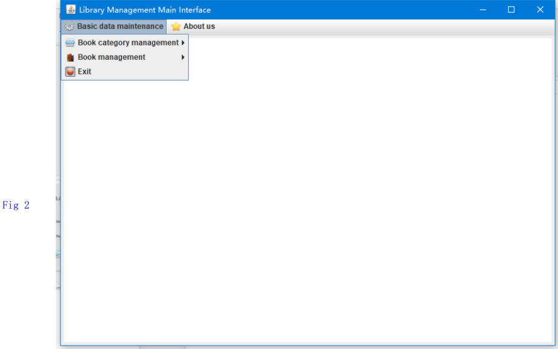
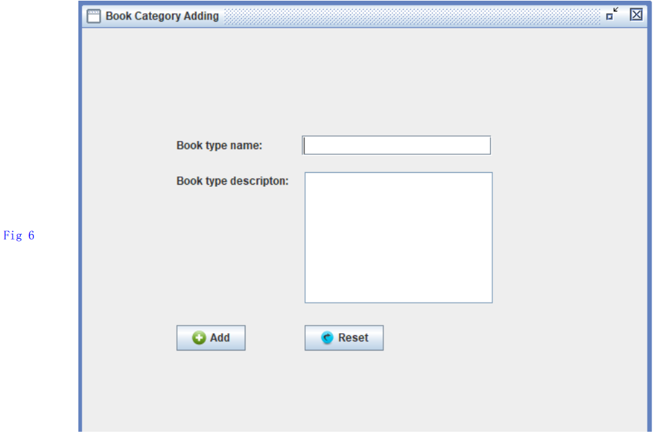
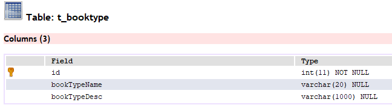
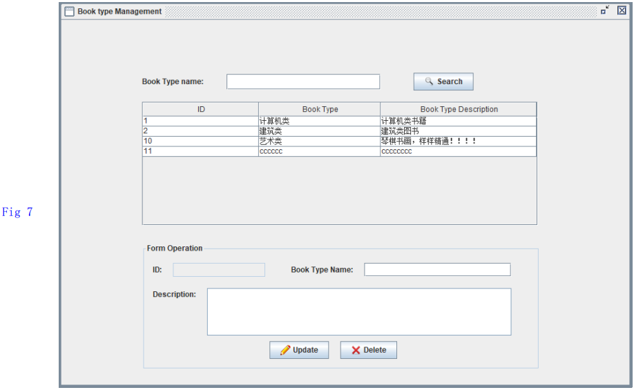
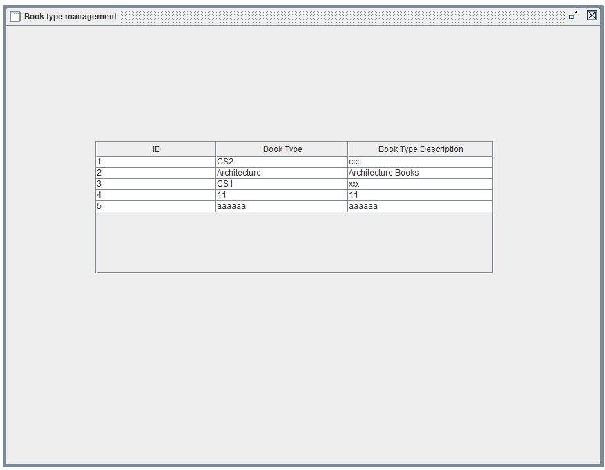
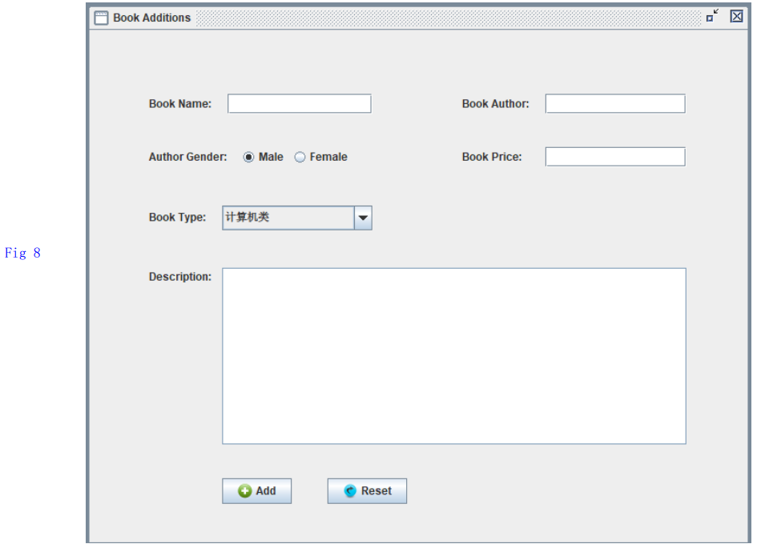
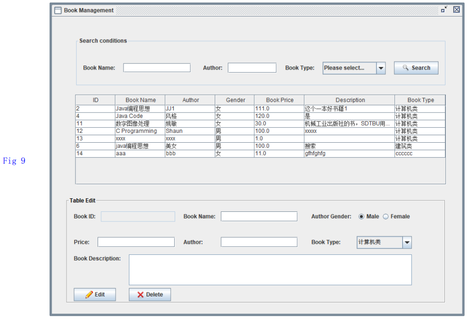
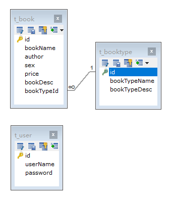

Implementation Tutorial of Book Management Application(Swing + Java + MySQL)
===
Author: Zhong-Liang Xiang (SDTBU)\
Email: ugoood@163.com \
Date: June 3, 2022

## 0. Preface

This is a text book telling about how to build a Book Management System by using Swing + Java + MySQL. The case of this materials Chinese version comes from https://space.bilibili.com/430390834/ .

Before implementing Book Management System, three tables should be built in DB(Database). The source DDL(Data Definition Language) code is at the last section "Appendix". The DB and three tables must be created first.

>Tips: 
1. vscode Collapse Code: ctrl+k, ctrl+0
2. `GroupLayout` is used to the most "Swing Containers" for easy placement of components.
3. Useful hot keys of Eclipse:

|Description|Hot Keys |
|:-:|:-:|
Annotation of a class |   /** enter
main()                |  `main` alt + /
Automatic assistance  |   alt + /   or   ctrl + 1
output a String       |  `syso` alt+/
Getter and Setter etc.|   alt + shift + s
import a class/classes|   ctrl + shift + o

## 1. DB Utils Class
We write the following code in order to operate DB easily by Java.

```java
package com.java1234.util;

import java.sql.Connection;
import java.sql.DriverManager;

/**
 * DB Utils Class
 * @author Administrator
 *
 */
public class DbUtil {
    private String dbUrl = "jdbc:mysql://localhost:3306/db_book"; // DB Connection address
    private String dbUserName = "root"; // DB user name
    private String dbPassword = "root"; // DB password
    private String jdbcName = "com.mysql.jdbc.Driver"; // DB Driver
    
    /**
     * Get DB Connection
     * @return
     * @throws Exception
     */
    public Connection getCon() throws Exception{
        Class.forName(jdbcName);
        Connection con = DriverManager.getConnection(dbUrl,dbUserName,dbPassword);
        return con;
    }
    
    /**
     * Close DB Connection
     * @param con
     * @throws Exception
     */
    public void closeCon(Connection con) throws Exception{
        if(con != null){
            con.close();
        }
    }
    
    public static void main(String[] args) {
        DbUtil dbUtil = new DbUtil();
        try {
            dbUtil.getCon();
            System.out.println("DB Connection: Success.");
        } catch (Exception e) {
            e.printStackTrace();
            System.out.println("DB Connection: Failed.");
        }
    }
}
```

## 2. User Login (LogOnFrm extends JFrame)

Create 3 packages:
|Package Name      |Description                    |
|:-:|:-:|
|com.java1234.dao  | data access object layer      |   
|com.java1234.model| entity layer                  |
|com.java1234.view | the appearance of application |

We create 3 classes(User, Book, BookType) in package com.java1234.model. The code are shown as follows:

class `User`:

```java
package com.java1234.model;

/**
 * User Entity
 * @author Administrator
 *
 */
public class User {
    private int id;
    private String userName;
    private String password;

    public User() {
        super();		
    }

    public User(String userName, String password) {
        super();
        this.userName = userName;
        this.password = password;
    }
    
    // ctrl + shift + s
    public int getId() {
        return id;
    }
    public void setId(int id) {
        this.id = id;
    }
    public String getUserName() {
        return userName;
    }
    public void setUserName(String userName) {
        this.userName = userName;
    }
    public String getPassword() {
        return password;
    }
    public void setPassword(String password) {
        this.password = password;
    }	
}
```

class `Book`:

```java
package com.java1234.model;

/**
 * Book Entity
 * @author Administrator
 *
 */
public class Book {
    private int id;
    private String bookName;
    private String author;
    private String sex;
    private Float price;
    private String bookDesc; // description of a book
    private Integer bookTypeId;
    private String BookTypeName;
    
    public Book() {
        super();		
    }
    
    public Book(String bookName, String author, String sex, Float price, String bookDesc, Integer bookTypeId) {
        super();
        this.bookName = bookName;
        this.author = author;
        this.sex = sex;
        this.price = price;
        this.bookDesc = bookDesc;
        this.bookTypeId = bookTypeId;
    }

    public Book(Integer id,String bookName, String author, String sex, Float price, String bookDesc, Integer bookTypeId) {
        super();
        this.id=id;
        this.bookName = bookName;
        this.author = author;
        this.sex = sex;
        this.price = price;
        this.bookDesc = bookDesc;
        this.bookTypeId = bookTypeId;
    }

    public Book(String bookName, String author, Integer bookTypeId) {
        super();
        this.bookName = bookName;
        this.author = author;
        this.bookTypeId = bookTypeId;
    }

    // TODO: generate getters and setters for all fields
    // use ctrl + shift + s
}
```

class `BookType`:

```java
package com.java1234.model;

/**
 * BookType Entity
 * @author Administrator
 *
 */
public class BookType {

    private int id;
    private String bookTypeName;
    private String bookTypeDesc; // description of a book type
    
    public BookType() {
        super();
    }
    public BookType(String bookTypeName, String bookTypeDesc) {
        super();
        this.bookTypeName = bookTypeName;
        this.bookTypeDesc = bookTypeDesc;
    }
    
    public BookType(int id, String bookTypeName, String bookTypeDesc) {
        super();
        this.id = id;
        this.bookTypeName = bookTypeName;
        this.bookTypeDesc = bookTypeDesc;
    }

    // TODO: generate getters and setters for all fields
    // use ctrl + shift + s

    @Override
    public String toString() {
        return this.getBookTypeName();
    }
}
```

In `com.java1234.dao` package, create a class named `UserDao`.

```java
/**
 * UserDao
 * @author xzl
 *
 */
public class UserDao {
    /**
     * Login verification
     * @param con
     * @param user
     * @return
     * @throws Exception
     */
    public User login(Connection con, User user) throws Exception{
        User resultUser = null;
        String sql = "select * from t_user where userName=? and password=?";
        PreparedStatement pstmt = con.prepareStatement(sql);
        pstmt.setString(1, user.getUserName());
        pstmt.setString(2, user.getPassword());
        ResultSet rs = pstmt.executeQuery();
        if(rs.next()) {
            resultUser = new User();
            resultUser.setId(rs.getInt("id"));
            resultUser.setUserName(rs.getString("userName"));
            resultUser.setPassword(rs.getString("password"));
        }
        return resultUser;
    }
}
```

Use a tool named `windowsbuilder` to create User Login Window(frame). Note that all frame code in our appliction should be saved in package `com.java1234.view`.

com.java1234.view -> new -> other -> windowbuilder -> Swing Designer -> JFrame -> name: LogOnFrm -> click Design button

See Fig. 1 in `java project outlook.pdf`.


>tip: How to add an event performed code? \
right click a button -> Add event handler -> action -> actionPerformed

Till now, all source code of LogOnFrm class is shown follows:

```java
package com.java1234.view;

import java.awt.BorderLayout;
import java.awt.EventQueue;

import javax.swing.JFrame;
import javax.swing.JPanel;
import javax.swing.border.EmptyBorder;

import com.java1234.dao.UserDao;
import com.java1234.model.User;
import com.java1234.util.DbUtil;
import com.java1234.util.StringUtil;

import javax.swing.GroupLayout;
import javax.swing.GroupLayout.Alignment;
import javax.swing.JLabel;
import javax.swing.JOptionPane;

import java.awt.Font;
import javax.swing.ImageIcon;
import javax.swing.JTextField;
import javax.swing.JButton;
import javax.swing.LayoutStyle.ComponentPlacement;
import java.awt.event.ActionListener;
import java.sql.Connection;
import java.awt.event.ActionEvent;
import javax.swing.JPasswordField;

public class LogOnFrm extends JFrame {

    private JPanel contentPane;
    private JTextField userNameTxt;
    private JPasswordField passwordTxt;
    
    DbUtil dbUtil = new DbUtil(); // <------------------------>
    UserDao userDao = new UserDao(); // <--------------------->

    /**
     * Launch the application.
     */
    public static void main(String[] args) {
        EventQueue.invokeLater(new Runnable() {
            public void run() {
                try {
                    LogOnFrm frame = new LogOnFrm();
                    frame.setVisible(true);
                } catch (Exception e) {
                    e.printStackTrace();
                }
            }
        });
    }

    /**
     * Create the frame.
     */
    public LogOnFrm() {
        setResizable(false);
        setTitle("Administrator Login");
        setDefaultCloseOperation(JFrame.EXIT_ON_CLOSE);
        setBounds(100, 100, 875, 663);
        contentPane = new JPanel();
        contentPane.setBorder(new EmptyBorder(5, 5, 5, 5));
        setContentPane(contentPane);
        
        JLabel lblNewLabel = new JLabel("Book Management System");
        lblNewLabel.setIcon(new ImageIcon(LogOnFrm.class.getResource("/images/logo.png")));
        lblNewLabel.setFont(new Font("宋体", Font.PLAIN, 40));
        
        JLabel lblNewLabel_1 = new JLabel("User Name:");
        lblNewLabel_1.setFont(new Font("宋体", Font.PLAIN, 21));
        lblNewLabel_1.setIcon(new ImageIcon(LogOnFrm.class.getResource("/images/userName.png")));
        
        JLabel lblNewLabel_2 = new JLabel("Password:");
        lblNewLabel_2.setFont(new Font("宋体", Font.PLAIN, 21));
        lblNewLabel_2.setIcon(new ImageIcon(LogOnFrm.class.getResource("/images/password.png")));
        
        userNameTxt = new JTextField();
        userNameTxt.setColumns(10);
        
        JButton btnNewButton = new JButton("Login");
        btnNewButton.addActionListener(new ActionListener() {
            // ---------- Login button action code <--------------------------------
            public void actionPerformed(ActionEvent e) {
                loginActionPerformed(e);
            }
        });
        btnNewButton.setIcon(new ImageIcon(LogOnFrm.class.getResource("/images/login.png")));
        
        JButton btnNewButton_1 = new JButton("Reset");
        btnNewButton_1.addActionListener(new ActionListener() {
            // <------------------Code of reset button action performed----------------
            public void actionPerformed(ActionEvent e) {
                resetValueActionPerformed(e);
            }
        });
        btnNewButton_1.setIcon(new ImageIcon(LogOnFrm.class.getResource("/images/reset.png")));
        
        passwordTxt = new JPasswordField();
        GroupLayout gl_contentPane = new GroupLayout(contentPane);
        gl_contentPane.setHorizontalGroup(
            gl_contentPane.createParallelGroup(Alignment.LEADING)
                .addGroup(gl_contentPane.createSequentialGroup()
                    .addContainerGap(161, Short.MAX_VALUE)
                    .addComponent(lblNewLabel, GroupLayout.PREFERRED_SIZE, 616, GroupLayout.PREFERRED_SIZE)
                    .addGap(82))
                .addGroup(gl_contentPane.createSequentialGroup()
                    .addGap(247)
                    .addGroup(gl_contentPane.createParallelGroup(Alignment.LEADING)
                        .addGroup(gl_contentPane.createSequentialGroup()
                            .addGap(81)
                            .addComponent(btnNewButton)
                            .addPreferredGap(ComponentPlacement.UNRELATED)
                            .addComponent(btnNewButton_1))
                        .addGroup(gl_contentPane.createSequentialGroup()
                            .addGroup(gl_contentPane.createParallelGroup(Alignment.LEADING)
                                .addComponent(lblNewLabel_1)
                                .addComponent(lblNewLabel_2))
                            .addGap(18)
                            .addGroup(gl_contentPane.createParallelGroup(Alignment.LEADING, false)
                                .addComponent(passwordTxt)
                                .addComponent(userNameTxt, GroupLayout.DEFAULT_SIZE, 203, Short.MAX_VALUE))))
                    .addContainerGap(261, Short.MAX_VALUE))
        );
        gl_contentPane.setVerticalGroup(
            gl_contentPane.createParallelGroup(Alignment.LEADING)
                .addGroup(gl_contentPane.createSequentialGroup()
                    .addGap(127)
                    .addComponent(lblNewLabel, GroupLayout.PREFERRED_SIZE, 41, GroupLayout.PREFERRED_SIZE)
                    .addGap(107)
                    .addGroup(gl_contentPane.createParallelGroup(Alignment.BASELINE)
                        .addComponent(userNameTxt, GroupLayout.PREFERRED_SIZE, GroupLayout.DEFAULT_SIZE, GroupLayout.PREFERRED_SIZE)
                        .addComponent(lblNewLabel_1))
                    .addGap(40)
                    .addGroup(gl_contentPane.createParallelGroup(Alignment.BASELINE)
                        .addComponent(lblNewLabel_2)
                        .addComponent(passwordTxt, GroupLayout.PREFERRED_SIZE, GroupLayout.DEFAULT_SIZE, GroupLayout.PREFERRED_SIZE))
                    .addGap(83)
                    .addGroup(gl_contentPane.createParallelGroup(Alignment.BASELINE)
                        .addComponent(btnNewButton)
                        .addComponent(btnNewButton_1))
                    .addContainerGap(151, Short.MAX_VALUE))
        );
        contentPane.setLayout(gl_contentPane);
    }
    
    // <-------------- we write the following code -------------->

    /**
     * Login Button action code
     * @param evt
     */
    private void loginActionPerformed(ActionEvent evt) {
        String userName = this.userNameTxt.getText();
        String password = new String(this.passwordTxt.getPassword());
        
         /* 
         a empty string?
         write a code to judge a string is empty or not
         create a class called StringUtil at the package com.java1234.util
         and use StringUtil
         */
        if(StringUtil.isEmpty(userName)) {
            JOptionPane.showMessageDialog(null, "User name can not be empty.");
            return;
        }
        if(StringUtil.isEmpty(password)) {
            JOptionPane.showMessageDialog(null, "Password can not be empty.");
            return;
        }
        
        // Read info. from DB
        User user = new User(userName, password);
        Connection con = null;
        try {
            con = dbUtil.getCon();
            User currentUser = userDao.login(con, user);  // save all fields of currentUser object
            if(currentUser != null) {
                JOptionPane.showMessageDialog(null, "Login success");  // will be replaced by other code
            }else {
                JOptionPane.showMessageDialog(null, "username and password are incorrect");
            }
        } catch (Exception e) {
            e.printStackTrace();
        }
    }

    /**
     * Reset Button action code
     * @param evt
     */
    private void resetValueActionPerformed(ActionEvent evt) {
        this.userNameTxt.setText("");
        this.passwordTxt.setText("");		
    }
}
```

Write the code helping us to judge a string is empty:

```java
package com.java1234.util;

/**
 * String Utils
 * @author xzl
 *
 */
public class StringUtil {
    /**
     * Judge a string is empty
     * @param str
     * @return
     */
    public static boolean isEmpty(String str) {
        if(str == null || "".equals(str.trim())) {
            return true;
        }else {
            return false;
        }
    }
}
```

## 3. Main Board (MainFrm extends JFrame)
The App main board will be open after successful login. This section will discuss that how to build main board of book management system.
As before, we will build MainFrm JFrame class first by using the tool called `windowbuilder`.
The outlook of main board is Fig. 2.


> Tip: how to add a menu into `JFrame`?
Find the Menu button in `windowbuilder`, and do as follows:
1. Menu -> `JMenuBar`
2. add `JMenu` into `JMenuBar`
3. add `JMenuItem` into `JMenu`

We add Containers -> JDesktopPane into Main Board and create several JInternalFrame class on JDesktopPane.
Create a class named `SDTBUInterFrm`, this frame will be opened when user click SDTBU button.

`SDTBUInterFrm` code:

```java
package com.java1234.view;

import java.awt.EventQueue;

import javax.swing.JInternalFrame;
import javax.swing.GroupLayout;
import javax.swing.GroupLayout.Alignment;
import javax.swing.JLabel;
import javax.swing.ImageIcon;

public class SDTBUInterFrm extends JInternalFrame {

    /**
     * Launch the application.
     */
    public static void main(String[] args) {
        EventQueue.invokeLater(new Runnable() {
            public void run() {
                try {
                    SDTBUInterFrm frame = new SDTBUInterFrm();
                    frame.setVisible(true);
                } catch (Exception e) {
                    e.printStackTrace();
                }
            }
        });
    }

    /**
     * Create the frame.
     */
    public SDTBUInterFrm() {
        setIconifiable(true);
        setClosable(true);
        setTitle("About SDTBU");
        setBounds(100, 100, 1393, 639);
        
        JLabel lblNewLabel = new JLabel("");
        lblNewLabel.setIcon(new ImageIcon(SDTBUInterFrm.class.getResource("/images/sdtbu.png")));
        GroupLayout groupLayout = new GroupLayout(getContentPane());
        groupLayout.setHorizontalGroup(
            groupLayout.createParallelGroup(Alignment.LEADING)
                .addGroup(groupLayout.createSequentialGroup()
                    .addGap(78)
                    .addComponent(lblNewLabel, GroupLayout.PREFERRED_SIZE, 1208, GroupLayout.PREFERRED_SIZE)
                    .addContainerGap(91, Short.MAX_VALUE))
        );
        groupLayout.setVerticalGroup(
            groupLayout.createParallelGroup(Alignment.LEADING)
                .addGroup(groupLayout.createSequentialGroup()
                    .addGap(258)
                    .addComponent(lblNewLabel)
                    .addContainerGap(269, Short.MAX_VALUE))
        );
        getContentPane().setLayout(groupLayout);
    }
}

```

We create a class named `MainFrm`, in which, till now, we need open the above `JInternalFrame` called `SDTBUInterFrm` when "SDTBU" button is clicked, and the hole app should be closed when "Exit" button is clicked.

The hole `MainFrm` in current stage is shown as follows(we should concern positions with several comments sames like `<--------------` in the following code):

```java
package com.java1234.view;

import java.awt.BorderLayout;
import java.awt.EventQueue;

import javax.swing.JFrame;
import javax.swing.JPanel;
import javax.swing.border.EmptyBorder;
import javax.swing.JMenuBar;
import javax.swing.JMenu;
import javax.swing.JMenuItem;
import javax.swing.JOptionPane;
import javax.swing.ImageIcon;
import javax.swing.JDesktopPane;
import java.awt.event.ActionListener;
import java.awt.event.ActionEvent;

public class MainFrm extends JFrame {

    private JPanel contentPane;
    private JDesktopPane table;

    /**
     * Launch the application.
     */
    public static void main(String[] args) {
        EventQueue.invokeLater(new Runnable() {
            public void run() {
                try {
                    MainFrm frame = new MainFrm();
                    frame.setVisible(true);
                } catch (Exception e) {
                    e.printStackTrace();
                }
            }
        });
    }

    /**
     * Create the frame.
     */
    public MainFrm() {
        setTitle("Book Management Main Board");
        setDefaultCloseOperation(JFrame.EXIT_ON_CLOSE);
        setBounds(100, 100, 1016, 841);
        
        JMenuBar menuBar = new JMenuBar();
        setJMenuBar(menuBar);
        
        JMenu mnNewMenu = new JMenu("Basic data maintenance");
        mnNewMenu.setIcon(new ImageIcon(MainFrm.class.getResource("/images/base.png")));
        menuBar.add(mnNewMenu);
        
        JMenu mnNewMenu_2 = new JMenu("Book category");
        mnNewMenu_2.setIcon(new ImageIcon(MainFrm.class.getResource("/images/bookTypeManager.png")));
        mnNewMenu.add(mnNewMenu_2);
        
        JMenuItem mntmNewMenuItem_2 = new JMenuItem("Add category");
        mntmNewMenuItem_2.setIcon(new ImageIcon(MainFrm.class.getResource("/images/add.png")));
        mnNewMenu_2.add(mntmNewMenuItem_2);
        
        JMenuItem mntmNewMenuItem_3 = new JMenuItem("Category Maintenance");
        mntmNewMenuItem_3.setIcon(new ImageIcon(MainFrm.class.getResource("/images/edit.png")));
        mnNewMenu_2.add(mntmNewMenuItem_3);
        
        JMenu mnNewMenu_3 = new JMenu("Book management");
        mnNewMenu_3.setIcon(new ImageIcon(MainFrm.class.getResource("/images/bookManager.png")));
        mnNewMenu.add(mnNewMenu_3);
        
        JMenuItem mntmNewMenuItem = new JMenuItem("Exit");
        mntmNewMenuItem.addActionListener(new ActionListener() {
            public void actionPerformed(ActionEvent e) { // <---------------here----------------
                int res = JOptionPane.showConfirmDialog(null, "Exit?"); // 0 yes, 1 no, 2 cancel
                if(res == 0) dispose();
            }
        });
        mntmNewMenuItem.setIcon(new ImageIcon(MainFrm.class.getResource("/images/exit.png")));
        mnNewMenu.add(mntmNewMenuItem);
        
        JMenu mnNewMenu_1 = new JMenu("About us");
        mnNewMenu_1.setIcon(new ImageIcon(MainFrm.class.getResource("/images/about.png")));
        menuBar.add(mnNewMenu_1);
        
        JMenuItem mntmNewMenuItem_1 = new JMenuItem("SDTBU");
        mntmNewMenuItem_1.addActionListener(new ActionListener() {
            public void actionPerformed(ActionEvent e) { // <---------------here----------------
                SDTBUInterFrm sdtbuInterFrm = new SDTBUInterFrm();
                sdtbuInterFrm.setVisible(true);
                table.add(sdtbuInterFrm);
            }
        });
        mnNewMenu_1.add(mntmNewMenuItem_1);
        contentPane = new JPanel();
        contentPane.setBorder(new EmptyBorder(5, 5, 5, 5));
        setContentPane(contentPane);
        contentPane.setLayout(new BorderLayout(0, 0));
        
        table = new JDesktopPane();
        contentPane.add(table, BorderLayout.CENTER);
        
        // set main board having max size boarder.
        this.setExtendedState(JFrame.MAXIMIZED_BOTH);
    }
}
```

## 4. Book Category
### 4.1 Book Category Adding
In this section, we are going to build Fig. 6 which will appear after "Add category" button clicked.



Following `t_booktype`(shown as follow figure), a table in DB, we need build a entity class `BookType` in java.




```java
package com.java1234.model;

/**
 * Book type entity
 * @author Administrator
 *
 */
public class BookType {

    private int id; 			 // book type id
    private String bookTypeName; // book type name
    private String bookTypeDesc; // book type description
    
    public BookType() {
        super();
    }
    
    public BookType(String bookTypeName, String bookTypeDesc) {
        super();
        this.bookTypeName = bookTypeName;
        this.bookTypeDesc = bookTypeDesc;
    }

    public int getId() {
        return id;
    }
    public void setId(int id) {
        this.id = id;
    }
    public String getBookTypeName() {
        return bookTypeName;
    }
    public void setBookTypeName(String bookTypeName) {
        this.bookTypeName = bookTypeName;
    }
    public String getBookTypeDesc() {
        return bookTypeDesc;
    }
    public void setBookTypeDesc(String bookTypeDesc) {
        this.bookTypeDesc = bookTypeDesc;
    }
}
```

The DAO class of `BookType` entity named `BookTypeDao` is shown as:

```java
package com.java1234.dao;

import java.sql.Connection;
import java.sql.PreparedStatement;

import com.java1234.model.BookType;


/**
 * BookType dao
 * @author Administrator
 *
 */
public class BookTypeDao {
    /**
     * Add a book type
     * @param con
     * @param bookType
     * @return
     * @throws Exception
     */
    public int add(Connection con,BookType bookType)throws Exception{
        String sql="insert into t_bookType values(null,?,?)";
        PreparedStatement pstmt=con.prepareStatement(sql);
        pstmt.setString(1, bookType.getBookTypeName());
        pstmt.setString(2, bookType.getBookTypeDesc());
        return pstmt.executeUpdate();  // return affected rows
    }
}
```

Create a `JInternalFrame` named `BookTypeAddInterFrm`.

```java
package com.java1234.view;

import java.awt.EventQueue;
import java.awt.event.ActionEvent;
import java.awt.event.ActionListener;
import java.sql.Connection;

import javax.swing.GroupLayout;
import javax.swing.GroupLayout.Alignment;
import javax.swing.ImageIcon;
import javax.swing.JButton;
import javax.swing.JInternalFrame;
import javax.swing.JLabel;
import javax.swing.JOptionPane;
import javax.swing.JTextArea;
import javax.swing.JTextField;
import javax.swing.LayoutStyle.ComponentPlacement;
import javax.swing.border.LineBorder;

import com.java1234.dao.BookTypeDao;
import com.java1234.model.BookType;
import com.java1234.util.DbUtil;
import com.java1234.util.StringUtil;

public class BookTypeAddInterFrm extends JInternalFrame {
    
    private JTextField bookTypeNameTxt;
    private JTextArea bookTypeDescTxt;
    
    private DbUtil dbUtil=new DbUtil();
    private BookTypeDao bookTypeDao=new BookTypeDao();

    /**
     * Launch the application.
     */
    public static void main(String[] args) {
        EventQueue.invokeLater(new Runnable() {
            public void run() {
                try {
                    BookTypeAddInterFrm frame = new BookTypeAddInterFrm();
                    frame.setVisible(true);
                } catch (Exception e) {
                    e.printStackTrace();
                }
            }
        });
    }

    /**
     * Create the frame.
     */
    public BookTypeAddInterFrm() {
        setClosable(true);
        setIconifiable(true);
        setTitle("Book Category Adding");
        setBounds(100, 100, 450, 300);
        
        JLabel lblNewLabel = new JLabel("Type:");
        
        JLabel lblNewLabel_1 = new JLabel("Type description:");
        
        bookTypeNameTxt = new JTextField();
        bookTypeNameTxt.setColumns(10);
        
        bookTypeDescTxt = new JTextArea();
        
        JButton btnNewButton = new JButton("Add");
        btnNewButton.addActionListener(new ActionListener() {// <-----------------
            public void actionPerformed(ActionEvent e) {
                bookTypeAddActionPerformed(e);
            }
        });
        btnNewButton.setIcon(new ImageIcon(BookTypeAddInterFrm.class.getResource("/images/add.png")));
        
        JButton btnNewButton_1 = new JButton("Reset");
        btnNewButton_1.addActionListener(new ActionListener() {// <-----------------
            public void actionPerformed(ActionEvent e) {
                resetValueActionPerformed(e);
            }
        });
        btnNewButton_1.setIcon(new ImageIcon(BookTypeAddInterFrm.class.getResource("/images/reset.png")));
        GroupLayout groupLayout = new GroupLayout(getContentPane());
        groupLayout.setHorizontalGroup(
            groupLayout.createParallelGroup(Alignment.LEADING)
                .addGroup(groupLayout.createSequentialGroup()
                    .addGap(14)
                    .addGroup(groupLayout.createParallelGroup(Alignment.TRAILING)
                        .addGroup(groupLayout.createSequentialGroup()
                            .addGroup(groupLayout.createSequentialGroup()
                                .addComponent(btnNewButton)
                                .addGap(35))
                            .addComponent(btnNewButton_1))
                        .addGroup(groupLayout.createSequentialGroup()
                            .addGroup(groupLayout.createParallelGroup(Alignment.LEADING)
                                .addComponent(lblNewLabel_1, Alignment.TRAILING)
                                .addComponent(lblNewLabel, Alignment.TRAILING))
                            .addPreferredGap(ComponentPlacement.UNRELATED)
                            .addGroup(groupLayout.createParallelGroup(Alignment.LEADING, false)
                                .addComponent(bookTypeDescTxt, Alignment.TRAILING)
                                .addComponent(bookTypeNameTxt, Alignment.TRAILING, GroupLayout.DEFAULT_SIZE, 185, Short.MAX_VALUE))))
                    .addContainerGap(113, GroupLayout.PREFERRED_SIZE))
        );
        groupLayout.setVerticalGroup(
            groupLayout.createParallelGroup(Alignment.LEADING)
                .addGroup(groupLayout.createSequentialGroup()
                    .addGap(56)
                    .addGroup(groupLayout.createParallelGroup(Alignment.BASELINE)
                        .addComponent(lblNewLabel)
                        .addComponent(bookTypeNameTxt, GroupLayout.PREFERRED_SIZE, GroupLayout.DEFAULT_SIZE, GroupLayout.PREFERRED_SIZE))
                    .addGap(29)
                    .addGroup(groupLayout.createParallelGroup(Alignment.BASELINE)
                        .addComponent(bookTypeDescTxt, GroupLayout.PREFERRED_SIZE, 85, GroupLayout.PREFERRED_SIZE)
                        .addComponent(lblNewLabel_1))
                    .addPreferredGap(ComponentPlacement.RELATED, 28, Short.MAX_VALUE)
                    .addGroup(groupLayout.createParallelGroup(Alignment.BASELINE)
                        .addComponent(btnNewButton)
                        .addComponent(btnNewButton_1))
                    .addGap(26))
        );
        getContentPane().setLayout(groupLayout);
        
        bookTypeDescTxt.setBorder(new LineBorder(new java.awt.Color(127,157,185), 1, false));

    }
    
    // <------------------------------------------------------------------
    /**
     * Add a book type
     * @param e
     */
    private void bookTypeAddActionPerformed(ActionEvent evt) {
        // 1. get info. from window
        String bookTypeName=this.bookTypeNameTxt.getText();
        String bookTypeDesc=this.bookTypeDescTxt.getText();
        // 2. do some reaction basing on given information
        if(StringUtil.isEmpty(bookTypeName)){
            JOptionPane.showMessageDialog(null, "Book type can not be empty");
            return;
        }
        BookType bookType=new BookType(bookTypeName,bookTypeDesc);
        Connection con=null;
        try{
            con=dbUtil.getCon();
            int n=bookTypeDao.add(con, bookType);
            if(n==1){
                JOptionPane.showMessageDialog(null, "Book type adding, success");
                resetValue();
            }else{
                JOptionPane.showMessageDialog(null, "Book type adding, failed");
            }
        }catch(Exception e){
            e.printStackTrace();
            JOptionPane.showMessageDialog(null, "Book type adding, failed");
        }finally{
            try {
                dbUtil.closeCon(con);
            } catch (Exception e) {
                e.printStackTrace();
            }
        }
    }

    /**
     * Reset
     * @param evt
     */
    private void resetValueActionPerformed(ActionEvent evt) {
        this.resetValue();
    }

    /**
     * Reset some fields
     */
    private void resetValue(){
        this.bookTypeNameTxt.setText("");
        this.bookTypeDescTxt.setText("");
    }
}
```

Meanwhile, little bit code need be inserted into `MainFrm`. When user click "Add category" button, `BookTypeAddInterFrm` should be open. The aciton performed code is:

```java
public void actionPerformed(ActionEvent e) {
    BookTypeAddInterFrm btaif = new BookTypeAddInterFrm();
    btaif.setVisible(true);
    table.add(btaif);
}
```

### 4.2 Book Type Management
The board of Book type management will be opened when user click "Basic data maintenance" -> "Book category management" -> "Category maintenance" button, which is shown as below:



Insert a code snippet(a function named 'list' which can return result set basing on a `BookType` entity) into `BookTypeDao`:

```java
/**
    * Give result set basing on a BookType entity
    * @param con
    * @param bookType
    * @return
    * @throws Exception
    */
public ResultSet list(Connection con,BookType bookType)throws Exception{
    StringBuffer sb=new StringBuffer("select * from t_bookType");
    if(!StringUtil.isEmpty(bookType.getBookTypeName())){
        sb.append(" and bookTypeName like '%" + bookType.getBookTypeName() + "%'");
    }
    // replace the 1st "and" to "where" to keep correct of sql 
    PreparedStatement pstmt=con.prepareStatement(sb.toString().replaceFirst("and", "where"));
    return pstmt.executeQuery();
}
```

In order to draw Fig. 7, we create a `javax.swing.JinternalFrame` class called `BookTypeManageInterFrm`.
In order to put a table in the panel, we need to do:
1. JScrollPane
2. Pull a Jtable into the JScrollPane
3. click model button of above Jtable, and set several column names such as "ID", "Book Type" and "Book Type Description", and set un-editable in column properties.

When user open Fig. 7, the book type table on Fig.7 should be initialized. Please readers focus on these code with comments `<------`.
The hole code of `BookTypeManageInterFrm` is at below:

```java
package com.java1234.view;

import java.awt.EventQueue;
import java.sql.Connection;
import java.sql.ResultSet;
import java.util.Vector;

import javax.swing.GroupLayout;
import javax.swing.GroupLayout.Alignment;
import javax.swing.JInternalFrame;
import javax.swing.JScrollPane;
import javax.swing.JTable;
import javax.swing.table.DefaultTableModel;

import com.java1234.dao.BookTypeDao;
import com.java1234.model.BookType;
import com.java1234.util.DbUtil;

public class BookTypeManageInterFrm extends JInternalFrame {
    private JTable bookTypeTable;        // <---------	
    private DbUtil dbUtil=new DbUtil();  // <---------
    private BookTypeDao bookTypeDao=new BookTypeDao();  // <---

    /**
     * Launch the application.
     */
    public static void main(String[] args) {
        EventQueue.invokeLater(new Runnable() {
            public void run() {
                try {
                    BookTypeManageInterFrm frame = new BookTypeManageInterFrm();
                    frame.setVisible(true);
                } catch (Exception e) {
                    e.printStackTrace();
                }
            }
        });
    }

    /**
     * Create the frame.
     */
    public BookTypeManageInterFrm() {
        setTitle("Book type management");
        setIconifiable(true);
        setClosable(true);
        setBounds(100, 100, 870, 669);
        
        JScrollPane scrollPane = new JScrollPane();
        GroupLayout groupLayout = new GroupLayout(getContentPane());
        groupLayout.setHorizontalGroup(
            groupLayout.createParallelGroup(Alignment.LEADING)
                .addGroup(groupLayout.createSequentialGroup()
                    .addGap(129)
                    .addComponent(scrollPane, GroupLayout.PREFERRED_SIZE, 577, GroupLayout.PREFERRED_SIZE)
                    .addContainerGap(148, Short.MAX_VALUE))
        );
        groupLayout.setVerticalGroup(
            groupLayout.createParallelGroup(Alignment.LEADING)
                .addGroup(groupLayout.createSequentialGroup()
                    .addGap(167)
                    .addComponent(scrollPane, GroupLayout.PREFERRED_SIZE, 192, GroupLayout.PREFERRED_SIZE)
                    .addContainerGap(280, Short.MAX_VALUE))
        );
        
        bookTypeTable = new JTable();
        bookTypeTable.setModel(new DefaultTableModel(
            new Object[][] {
            },
            new String[] {
                "ID", "Book Type", "Book Type Description"
            }
        ) {
            boolean[] columnEditables = new boolean[] {
                false, false, false
            };
            public boolean isCellEditable(int row, int column) {
                return columnEditables[column];
            }
        });
        bookTypeTable.getColumnModel().getColumn(0).setPreferredWidth(113);
        bookTypeTable.getColumnModel().getColumn(1).setPreferredWidth(130);
        bookTypeTable.getColumnModel().getColumn(2).setPreferredWidth(149);
        scrollPane.setViewportView(bookTypeTable);
        getContentPane().setLayout(groupLayout);
        
        // Initialize book type table  <--------
        this.fillTable(new BookType()); 
    }
    
    // <----------------------------------------
    /**
     * Initialize book type table by a given bookType object
     * @param bookType
     */
    private void fillTable(BookType bookType){
        DefaultTableModel dtm=(DefaultTableModel) bookTypeTable.getModel();
        dtm.setRowCount(0); // let table be empty
        Connection con=null;
        try{
            con=dbUtil.getCon();
            ResultSet rs=bookTypeDao.list(con, bookType);
            while(rs.next()){
                Vector v=new Vector();
                v.add(rs.getString("id"));
                v.add(rs.getString("bookTypeName"));
                v.add(rs.getString("bookTypeDesc"));
                dtm.addRow(v);  // insert a data row into table
            }
        }catch(Exception e){
            e.printStackTrace();
        }finally{
            try {
                dbUtil.closeCon(con);
            } catch (Exception e) {
                e.printStackTrace();
            }
        }
    }
}
```

In order to run `BookTypeManageInterFrm`, we add an event handler to "Category Maintenance" button, the code is shown as follow:

```java
public void actionPerformed(ActionEvent e) {
    BookTypeManageInterFrm btmif = new BookTypeManageInterFrm();
    btmif.setVisible(true);
    table.add(btmif);
}
```

Now, the book type table will be shown as below when we click "Category Maintenance" button.


We keep on designing the above board, adding a label, a text field and a "search" button according Fig. 7.

The event handler is added for "search" button with the code:

```java
JButton btnNewButton = new JButton("Search");
btnNewButton.addActionListener(new ActionListener() {  // <---------
    public void actionPerformed(ActionEvent e) {
        bookTypeSearchActionPerformed(e);
    }
});
```

where `bookTypeSearchActionPerformed` function is defined as:

```java
/**
 * Book type search event handler
 * @param evt
 */
private void bookTypeSearchActionPerformed(ActionEvent evt) {
    String s_bookTypeName = this.s_bookTypeNameTxt.getText();
    BookType bookType = new BookType();
    bookType.setBookTypeName(s_bookTypeName);
    // fill book type table by given info. stemming from book type text field
    this.fillTable(bookType);  
}
```

### 4.3 Implementations of Book Type Edit & Delete
This section aims to implement the lower part of Fig. 7.
In order to implement delete and update behavor of book type, two functions such as `delete` and `update` are added in the class `BookTypeDao`. The source code of them is:

```java
/**
 * delete a book type by given book type ID
 * @param con
 * @param id
 * @return
 * @throws Exception
 */
public int delete(Connection con,String id)throws Exception{
    String sql="delete from t_bookType where id=?";
    PreparedStatement pstmt=con.prepareStatement(sql);
    pstmt.setString(1, id);
    return pstmt.executeUpdate();
}
    

```

```java
/**
 * update a book type by given BookType object
 * @param con
 * @param bookType
 * @return
 * @throws Exception
 */
public int update(Connection con,BookType bookType)throws Exception{
    String sql="update t_bookType set bookTypeName=?,bookTypeDesc=? where id=?";
    PreparedStatement pstmt=con.prepareStatement(sql);
    pstmt.setString(1, bookType.getBookTypeName());
    pstmt.setString(2, bookType.getBookTypeDesc());
    pstmt.setInt(3, bookType.getId());
    return pstmt.executeUpdate();
}
```

In order to draw the lower part of Fig. 7, we pull one of containers, `JPanel`, to the lower part of the board. Several components according to Fig.7 will insert in `JPanel` object. One of properties of `JPanel`, "border", is set to be `TitledBorder` and write the title as "Book Type Operation".
We rename three text field as "idTxt", "bookTypeNameTxt" and "bookTypeDescTxt" in order to easily call them, seperately.

Our idea is that when user click data row of book type table, the information of the row will be copied to the lower part of Fig.7. We can update and delete book type information basing on these components attached on `Jpanel` which titled "Book Type Operation".

To make the above idea come true, we need do the follows:
Find out a componet named `bookTypeTable`, and add `mousePressed` event handler.

The code snippets in `BookTypeManageInterFrm` are:

```java
// `mousePressed` event handler
bookTypeTable.addMouseListener(new MouseAdapter() {
    public void mousePressed(MouseEvent e) {
        bookTypeTableMousePressed(e);  // <------
    }
});
```

```java
/**
 * Book type row pressed event handler
 * @param e
 */
private void bookTypeTableMousePressed(MouseEvent evt) {
    int row = bookTypeTable.getSelectedRow();
    // id
    idTxt.setText((String) bookTypeTable.getValueAt(row, 0));
    // book type name
    bookTypeNameTxt.setText((String) bookTypeTable.getValueAt(row, 1));
    // book type description
    bookTypeDescTxt.setText((String) bookTypeTable.getValueAt(row, 2));		
}
```

Add an event handler to the button "Update".

```java
JButton btnNewButton_1 = new JButton("Update");
btnNewButton_1.addActionListener(new ActionListener() {
    public void actionPerformed(ActionEvent e) {  
        bookTypeUpdateActionEvent(e);  //<---------
    }
});
```

```java
/**
* update
* @param evt
*/
private void bookTypeUpdateActionEvent(ActionEvent evt) {
    // 1. get all information from three components
    String id=idTxt.getText();
    String bookTypeName=bookTypeNameTxt.getText();
    String bookTypeDesc=bookTypeDescTxt.getText();

    // 2. verify availability
    if(StringUtil.isEmpty(id)){
        JOptionPane.showMessageDialog(null, "You must choose a row");
        return;
    }
    if(StringUtil.isEmpty(bookTypeName)){
        JOptionPane.showMessageDialog(null, "Book type name can not be empty");
        return;
    }
    // 3. collect all information and store them into a BookType entity
    BookType bookType=new BookType(Integer.parseInt(id),bookTypeName,bookTypeDesc);

    // 4. operate DB: store new book type information to DB
    Connection con=null;
    try{
        con=dbUtil.getCon();
        int modifyNum=bookTypeDao.update(con, bookType);
        if(modifyNum==1){
            JOptionPane.showMessageDialog(null, "Update successfully");
            this.resetValue();
            this.fillTable(new BookType());
        }else{
            JOptionPane.showMessageDialog(null, "Update failed");
        }
    }catch(Exception e){
        e.printStackTrace();
        JOptionPane.showMessageDialog(null, "Update failed");
    }finally{
        try {
            dbUtil.closeCon(con);
        } catch (Exception e) {			
            e.printStackTrace();
        }
    }
}

/**
 * reset
 */
private void resetValue(){
    this.idTxt.setText("");
    this.bookTypeNameTxt.setText("");
    this.bookTypeDescTxt.setText("");
}
```

Add some new code to `BookType` class.

```java
public BookType(int id, String bookTypeName, String bookTypeDesc) {
    super();
    this.id = id;
    this.bookTypeName = bookTypeName;
    this.bookTypeDesc = bookTypeDesc;
}
```

Add event handler to "Delete" button.

```java
JButton btnNewButton_1 = new JButton("Delete");
btnNewButton_1.addActionListener(new ActionListener() {
    public void actionPerformed(ActionEvent e) {
        bookTypeDeleteActionEvent(e);
    }
});
```

```java
/**
 * delete
 * @param e
 */
private void bookTypeDeleteActionEvent(ActionEvent evt) {
    // 1. verify id is available or not
    String id = idTxt.getText();
    if(StringUtil.isEmpty(id)){
        JOptionPane.showMessageDialog(null, "Please pick a row");
        return;
    }
    // 2. user click button "Yes", then operate DB to delete the corresponding record
    int n = JOptionPane.showConfirmDialog(null, "delete this row?");
    if(n == 0){
        Connection con=null;
        try{
            con=dbUtil.getCon();
            int deleteNum = bookTypeDao.delete(con, id);  // do the delete
            if(deleteNum == 1){
                JOptionPane.showMessageDialog(null, "delete successfully");
                this.resetValue();
                this.fillTable(new BookType());
            }else{
                JOptionPane.showMessageDialog(null, "delete failed");
            }
        }catch(Exception e){
            e.printStackTrace();
            JOptionPane.showMessageDialog(null, "delete failed");
        }finally{
            try {
                dbUtil.closeCon(con);
            } catch (Exception e) {
                e.printStackTrace();
            }
        }
    }
}
```

## 5. Book Management
### 5.1 Add Book
The Fig. 8 will be shown when user click "Add book" button located at App main board.

To create Fig. 8 and run some functions, several things we need to do beforehand.
1. Create a class `BookDao` and add a new method named `add` in order to help user operate DB to add a new book into DB.

```java
/**
 * Book DAO
 * @author xzl
 *
 */
public class BookDao {
    /**
     * Book add
     * @param con
     * @param book
     * @return
     * @throws Exception
     */
    public int add(Connection con,Book book)throws Exception{
        String sql="insert into t_book values(null,?,?,?,?,?,?)";
        PreparedStatement pstmt=con.prepareStatement(sql);
        pstmt.setString(1, book.getBookName());
        pstmt.setString(2, book.getAuthor());
        pstmt.setString(3, book.getSex());
        pstmt.setFloat(4, book.getPrice());
        pstmt.setString(5, book.getBookDesc());
        pstmt.setInt(6, book.getBookTypeId());		
        return pstmt.executeUpdate();
    }
}
```

2. Draw Fig. 8 by using "windowbuilder".
Create a `JInternalFrame` class named `BookAddInterFrm`.
Two new useful components, such as `JRadioButton` for author gender and `JComboBox` for the list of book types, we need concern.

For "Author Gender", we set two `JRadioButton` components, "Male" and "Female". Then, we click `JRadioButton` "Male", set ButtonGroup -> new standard, after that, click `JRadioButton` "Female", set ButtonGroup -> buttonGrop. The "Male" and "Female" are in the same group now that forces user to choose only one of them.
For "Book Type", we set a `JComboBox` component.

The corresponding component variable name will be renamed, such as, `bookNameTxt`, `authorTxt`, `priceTxt`, `bookDescTxt`, `bookTypeJcb` for the `JComboBox` component, `maleJrb` for the "male" `JRadioButton` components, `femaleJrb` for the "female" `JRadioButton` components.

Naturally, jumping to `MainFrm`, we need add a event handler for the "Book management" -> "Add book" button. The code is:

```java
JMenuItem mntmNewMenuItem_4 = new JMenuItem("Add book");
        mntmNewMenuItem_4.addActionListener(new ActionListener() {
            public void actionPerformed(ActionEvent e) { // <----here----
                BookAddInterFrm baif = new BookAddInterFrm();
                baif.setVisible(true);
                table.add(baif);
            }
        });
```

3. Initialize contents of "Book Type"(that is, an object `JComboBox`) when Fig. 8 opened. 
Write a code snippet into class `BookAddInterFrm` as follows:

```java
/**
 * Initialize contents of "Book Type"(that is, an object `JComboBox`) 
 */
private void fillBookType(){
    Connection con=null;
    BookType bookType=null;
    try{
        con=dbUtil.getCon();
        // get all rows of book type from DB
        ResultSet rs=bookTypeDao.list(con, new BookType());
        while(rs.next()){
            bookType=new BookType();
            bookType.setId(rs.getInt("id"));
            bookType.setBookTypeName(rs.getString("bookTypeName"));
            this.bookTypeJcb.addItem(bookType);  // add an item into JComboBox object
        }
    }catch(Exception e){
        e.printStackTrace();
    }finally{
        try {
            dbUtil.closeCon(con);
        } catch (Exception e) {				
            e.printStackTrace();
        }
    }
}
```

To call the above code when Fig. 8 opened, we write `fillBookType();` to the last line of the body of method `BookAddInterFrm()`. Meanwhile, the method `toString` at the entity class `BookType` should be overwritten as the following code for correctlly presenting book type name, rather than memory address of an object of `BookType`.

```java
// copy this to class BookType
@Override
public String toString() {
    return this.bookTypeName;
}
```

4. Add actions for button "Add" and "Reset" at Fig. 8 seperatelly.

```java
JButton btnNewButton = new JButton("Add");
btnNewButton.addActionListener(new ActionListener() {
    public void actionPerformed(ActionEvent e) {//<--------
        bookAddActionPerformed(e);
    }
});
```

The method `bookAddActionPerformed` is:

```java
/**
 * Addbook handler
 * @param e
 */
private void bookAddActionPerformed(ActionEvent evt) {
    // 1. fetch book info. from components of board
    String bookName = this.bookNameTxt.getText();
    String author = this.authorTxt.getText();
    String price = this.priceTxt.getText();
    String bookDesc = this.bookDescTxt.getText();
    
    // 2. verify book info.
    if(StringUtil.isEmpty(bookName)){
        JOptionPane.showMessageDialog(null, "Book name can not be empty");
        return;
    }		
    if(StringUtil.isEmpty(author)){
        JOptionPane.showMessageDialog(null, "Author can not be empty");
        return;
    }		
    if(StringUtil.isEmpty(price)){
        JOptionPane.showMessageDialog(null, "Price can not be empty");
        return;
    }
    
    // get gender value from JRadioButton objects
    String sex="";
    if(maleJrb.isSelected()){
        sex = "male";
    }else if(femaleJrb.isSelected()){
        sex = "female";
    }
    
    // get book type from JComboBox object, bookTypeJcb
    // The item is a BookType object which have stored all fields including book type id
    BookType bookType=(BookType) bookTypeJcb.getSelectedItem();  
    int bookTypeId=bookType.getId();
    
    // 3. enclose one full book info. to a Book object
    Book book=new Book(bookName, author, sex, Float.parseFloat(price), bookTypeId,  bookDesc);
    
    // 4. operate DB to save that book info. to DB.
    Connection con=null;
    try{
        con=dbUtil.getCon();
        int addNum=bookDao.add(con, book);
        if(addNum==1){
            JOptionPane.showMessageDialog(null, "Add a book successfully");
            resetValue();
        }else{
            JOptionPane.showMessageDialog(null, "Add a book failed");
        }
    }catch(Exception e){
        e.printStackTrace();
        JOptionPane.showMessageDialog(null, "Add a book failed");
    }finally{
        try {
            dbUtil.closeCon(con);
        } catch (Exception e) {
            e.printStackTrace();
        }
    }
}
```

"Reset" button event handler:

```java
JButton btnNewButton_1 = new JButton("Reset");
btnNewButton_1.addActionListener(new ActionListener() {
    public void actionPerformed(ActionEvent e) { //<-----
        resetValue();
    }
});
```

where `resetValue` method is:

```java
/**
 * reset
 */
private void resetValue(){
    this.bookNameTxt.setText("");
    this.authorTxt.setText("");
    this.priceTxt.setText("");
    this.maleJrb.setSelected(true);
    this.bookDescTxt.setText("");
    if(this.bookTypeJcb.getItemCount() > 0){
        this.bookTypeJcb.setSelectedIndex(0);
    }
}
```

### 5.2 Book Search
We will implement the upper part of the Fig.9, that is, book search function.

Several things we need to do:
1. Go to `BookDao`, creating a new method called `list` which is for query book info. by a given `Book` object. Based on the requirements of Fig.8, we will use DB inner query technique because the information we wanted stems from two DB tables, `t_book` and `t_booktype`.

```java
/**
 * Book information query
 * @param con
 * @param book
 * @return
 * @throws Exception
*/
public ResultSet list(Connection con, Book book)throws Exception{
    StringBuffer sb=new StringBuffer("select * from t_book b,t_bookType bt where b.bookTypeId=bt.id");
    if(!StringUtil.isEmpty(book.getBookName())){
        sb.append(" and b.bookName like '%" + book.getBookName() + "%'");
    }
    if(!StringUtil.isEmpty(book.getAuthor())){
        sb.append(" and b.author like '%" + book.getAuthor() + "%'");
    }
    if(book.getBookTypeId() != null && book.getBookTypeId() != -1){
        sb.append(" and b.bookTypeId=" + book.getBookTypeId());
    }
    PreparedStatement pstmt=con.prepareStatement(sb.toString());
    return pstmt.executeQuery();
}
```

2. Create a `JInternalFrame` object, named `BookManageInterFrm` for draw the upper part of Fig. 9. We rename components as "s_bookNameTxt", "s_authorTxt", "s_bookTypeJcb".

In `MainFrm`, we add the following code to open `BookManageInterFrm` when button "Book maintenance" clicked:

```java
JMenuItem mntmNewMenuItem_5 = new JMenuItem("Book maintenance");
mntmNewMenuItem_5.addActionListener(new ActionListener() {
    public void actionPerformed(ActionEvent e) {// <--------here---------
        BookManageInterFrm bmif = new BookManageInterFrm();
        bmif.setVisible(true);
        table.add(bmif);
    }
});
```

3. Initialize table component at the upper of Fig. 9 and table will show different contents when a user clicks the button "Search" and sets different serach conditions.

```java
package com.java1234.view;

import java.awt.EventQueue;
import java.awt.event.ActionEvent;
import java.sql.Connection;
import java.sql.ResultSet;
import java.util.Vector;

import javax.swing.GroupLayout;
import javax.swing.GroupLayout.Alignment;
import javax.swing.ImageIcon;
import javax.swing.JButton;
import javax.swing.JComboBox;
import javax.swing.JInternalFrame;
import javax.swing.JLabel;
import javax.swing.JPanel;
import javax.swing.JScrollPane;
import javax.swing.JTable;
import javax.swing.JTextField;
import javax.swing.LayoutStyle.ComponentPlacement;
import javax.swing.border.TitledBorder;
import javax.swing.table.DefaultTableModel;

import com.java1234.dao.BookDao;
import com.java1234.dao.BookTypeDao;
import com.java1234.model.Book;
import com.java1234.model.BookType;
import com.java1234.util.DbUtil;
import java.awt.event.ActionListener;

public class BookManageInterFrm extends JInternalFrame {
    private JTable bookTable;
    private JTextField s_bookNameTxt;
    private JTextField s_authorTxt;
    private JComboBox s_bookTypeJcb; // <------
    
    private DbUtil dbUtil=new DbUtil(); // <------
    private BookTypeDao bookTypeDao=new BookTypeDao(); // <------
    private BookDao bookDao=new BookDao(); // <------

    /**
     * Launch the application.
     */
    public static void main(String[] args) {
        EventQueue.invokeLater(new Runnable() {
            public void run() {
                try {
                    BookManageInterFrm frame = new BookManageInterFrm();
                    frame.setVisible(true);
                } catch (Exception e) {
                    e.printStackTrace();
                }
            }
        });
    }

    /**
     * Create the frame.
     */
    public BookManageInterFrm() {
        setTitle("Book Management");
        setClosable(true);
        setIconifiable(true);
        setBounds(100, 100, 1164, 939);
        
        JScrollPane scrollPane = new JScrollPane();
        
        JPanel panel = new JPanel();
        panel.setBorder(new TitledBorder(null, "Query conditions", TitledBorder.LEADING, TitledBorder.TOP, null, null));
        GroupLayout groupLayout = new GroupLayout(getContentPane());
        groupLayout.setHorizontalGroup(
            groupLayout.createParallelGroup(Alignment.LEADING)
                .addGroup(Alignment.TRAILING, groupLayout.createSequentialGroup()
                    .addContainerGap(116, Short.MAX_VALUE)
                    .addGroup(groupLayout.createParallelGroup(Alignment.LEADING)
                        .addComponent(panel, GroupLayout.PREFERRED_SIZE, 917, GroupLayout.PREFERRED_SIZE)
                        .addComponent(scrollPane, GroupLayout.PREFERRED_SIZE, 920, GroupLayout.PREFERRED_SIZE))
                    .addGap(112))
        );
        groupLayout.setVerticalGroup(
            groupLayout.createParallelGroup(Alignment.LEADING)
                .addGroup(groupLayout.createSequentialGroup()
                    .addGap(59)
                    .addComponent(panel, GroupLayout.PREFERRED_SIZE, 96, GroupLayout.PREFERRED_SIZE)
                    .addGap(32)
                    .addComponent(scrollPane, GroupLayout.PREFERRED_SIZE, 220, GroupLayout.PREFERRED_SIZE)
                    .addContainerGap(502, Short.MAX_VALUE))
        );
        
        JLabel lblNewLabel = new JLabel("Book name:");
        
        s_bookNameTxt = new JTextField();
        s_bookNameTxt.setColumns(10);
        
        JLabel lblNewLabel_1 = new JLabel("Author:");
        
        s_authorTxt = new JTextField();
        s_authorTxt.setColumns(10);
        
        JLabel lblNewLabel_2 = new JLabel("Book type:");
        
        s_bookTypeJcb = new JComboBox();
        
        JButton btnNewButton = new JButton("Search");
        btnNewButton.addActionListener(new ActionListener() {
            public void actionPerformed(ActionEvent e) {//<--------
                bookSearchActionPerformed(e);
            }
        });
        btnNewButton.setIcon(new ImageIcon(BookManageInterFrm.class.getResource("/images/search.png")));
        GroupLayout gl_panel = new GroupLayout(panel);
        gl_panel.setHorizontalGroup(
            gl_panel.createParallelGroup(Alignment.LEADING)
                .addGroup(gl_panel.createSequentialGroup()
                    .addContainerGap()
                    .addComponent(lblNewLabel)
                    .addPreferredGap(ComponentPlacement.RELATED)
                    .addComponent(s_bookNameTxt, GroupLayout.PREFERRED_SIZE, 190, GroupLayout.PREFERRED_SIZE)
                    .addGap(38)
                    .addComponent(lblNewLabel_1)
                    .addPreferredGap(ComponentPlacement.UNRELATED)
                    .addComponent(s_authorTxt, GroupLayout.PREFERRED_SIZE, 157, GroupLayout.PREFERRED_SIZE)
                    .addGap(18)
                    .addComponent(lblNewLabel_2)
                    .addPreferredGap(ComponentPlacement.UNRELATED)
                    .addComponent(s_bookTypeJcb, GroupLayout.PREFERRED_SIZE, 167, GroupLayout.PREFERRED_SIZE)
                    .addPreferredGap(ComponentPlacement.RELATED, 28, Short.MAX_VALUE)
                    .addComponent(btnNewButton)
                    .addGap(22))
        );
        gl_panel.setVerticalGroup(
            gl_panel.createParallelGroup(Alignment.LEADING)
                .addGroup(gl_panel.createSequentialGroup()
                    .addGap(29)
                    .addGroup(gl_panel.createParallelGroup(Alignment.BASELINE)
                        .addComponent(lblNewLabel)
                        .addComponent(s_bookNameTxt, GroupLayout.PREFERRED_SIZE, GroupLayout.DEFAULT_SIZE, GroupLayout.PREFERRED_SIZE)
                        .addComponent(lblNewLabel_1)
                        .addComponent(s_authorTxt, GroupLayout.PREFERRED_SIZE, GroupLayout.DEFAULT_SIZE, GroupLayout.PREFERRED_SIZE)
                        .addComponent(lblNewLabel_2)
                        .addComponent(s_bookTypeJcb, GroupLayout.PREFERRED_SIZE, GroupLayout.DEFAULT_SIZE, GroupLayout.PREFERRED_SIZE)
                        .addComponent(btnNewButton))
                    .addContainerGap(23, Short.MAX_VALUE))
        );
        panel.setLayout(gl_panel);
        
        bookTable = new JTable();
        bookTable.setModel(new DefaultTableModel(
            new Object[][] {
            },
            new String[] {
                "ID", "Book name", "Author", "Gender", "Book price", "Description", "Book type"
            }
        ) {
            boolean[] columnEditables = new boolean[] {
                false, false, false, false, false, false, false
            };
            public boolean isCellEditable(int row, int column) {
                return columnEditables[column];
            }
        });
        scrollPane.setViewportView(bookTable);
        getContentPane().setLayout(groupLayout);
        
        this.fillBookType("search"); // <------init. dropdown box when open this board
        this.fillTable(new Book());  // <------init. table when open this board
    }
    
    
    // ------------------- Our code lives under this line ---------------------
    
    /**
     * Book query handler
     * @param e
     */
    private void bookSearchActionPerformed(ActionEvent evt) {
        String bookName=this.s_bookNameTxt.getText();
        String author=this.s_authorTxt.getText();
        BookType bookType=(BookType)this.s_bookTypeJcb.getSelectedItem();
        int bookTypeId=bookType.getId();
        
        Book book=new Book(bookName, author, bookTypeId);
        this.fillTable(book);
    }

    /**
     * Init. dropdown box
     * @param type: we have 2 dropdown box, the type here as an identifier to show which dropdown box is 
     */
    private void fillBookType(String type){
        Connection con=null;
        BookType bookType=null;
        try{
            con=dbUtil.getCon();
            ResultSet rs = bookTypeDao.list(con, new BookType());  // get all data
            if("search".equals(type)){
                bookType=new BookType();
                bookType.setBookTypeName("请选择...");
                bookType.setId(-1);
                this.s_bookTypeJcb.addItem(bookType);
            }
            while(rs.next()){
                bookType=new BookType();
                bookType.setBookTypeName(rs.getString("bookTypeName"));
                bookType.setId(rs.getInt("id"));
                if("search".equals(type)){
                    this.s_bookTypeJcb.addItem(bookType);
                }else if("modify".equals(type)){
                    // TODO
                }
            }
        }catch(Exception e){
            e.printStackTrace();
        }finally{
            try {
                dbUtil.closeCon(con);
            } catch (Exception e) {
                e.printStackTrace();
            }
        }
    }
    
    /**
     * Init table
     * @param book
     */
    private void fillTable(Book book){
        DefaultTableModel dtm=(DefaultTableModel) bookTable.getModel();
        dtm.setRowCount(0); // clear the contents of the table
        // query DB by given Book entity
        Connection con=null;
        try{
            con=dbUtil.getCon();
            ResultSet rs=bookDao.list(con, book);
            while(rs.next()){
                Vector v=new Vector();
                v.add(rs.getString("id"));
                v.add(rs.getString("bookName"));
                v.add(rs.getString("author"));
                v.add(rs.getString("sex"));
                v.add(rs.getFloat("price"));
                v.add(rs.getString("bookDesc"));
                v.add(rs.getString("bookTypeName"));
                dtm.addRow(v);  // add info. into DefaultTableModel
            }
        }catch(Exception e){
            e.printStackTrace();
        }finally{
            try {
                dbUtil.closeCon(con);
            } catch (Exception e) {
                e.printStackTrace();
            }
        }
    }
}
```

### 5.3 Book Update and Delete
#### 5.3.1 Book Update

We need alter class `BookDao` to add several methods for book update and delete.

```java
/**
 * book delete
 * @param con
 * @param id
 * @return
 * @throws Exception
 */
public int delete(Connection con,String id)throws Exception{
    String sql="delete from t_book where id=?";
    PreparedStatement pstmt=con.prepareStatement(sql);
    pstmt.setString(1, id);
    return pstmt.executeUpdate();
}

/**
 * book update
 * @param con
 * @param book
 * @return
 * @throws Exception
 */
public int update(Connection con,Book book)throws Exception{
    String sql="update t_book set bookName=?,author=?,sex=?,price=?,bookDesc=?,bookTypeId=? where id=?";
    PreparedStatement pstmt=con.prepareStatement(sql);
    pstmt.setString(1, book.getBookName());
    pstmt.setString(2, book.getAuthor());
    pstmt.setString(3, book.getSex());
    pstmt.setFloat(4, book.getPrice());
    pstmt.setString(5, book.getBookDesc());
    pstmt.setInt(6, book.getBookTypeId());
    pstmt.setInt(7, book.getId());
    return pstmt.executeUpdate();
}

/**
 * Given a book type, the book is exist or not
 * @param con
 * @param bookTypeId
 * @return
 * @throws Exception
 */
public boolean existBookByBookTypeId(Connection con,String bookTypeId)throws Exception{
    String sql="select * from t_book where bookTypeId=?";
    PreparedStatement pstmt=con.prepareStatement(sql);
    pstmt.setString(1, bookTypeId);
    ResultSet rs=pstmt.executeQuery();
    return rs.next();  // resultset is empty or not
}
```

Draw the lower part of Fig.9 and rename several components as "idTxt", "bookNameTxt", "maleJrb", "femaleJrb", "priceTxt", "authorTxt", "bookTypeJcb", "bookDescTxt".
Our idea is the book info. will be shown at the lower part of Fig.9 when a user click a data row at the upper part of Fig.9. We need to do as follows.

Right click "bookTable" componet at the upper of the board and choose "mousePressed" event handler, write down the following code:

```java
bookTable.addMouseListener(new MouseAdapter() {
    @Override
    public void mousePressed(MouseEvent met) {//<------
        bookTableMousePressed(met);
    }
});
```

The method `bookTableMousePressed` is defined as:

```java
/**
 * table row mouse click event handler 
 * @param met
 */
private void bookTableMousePressed(MouseEvent met) {
    // 1. get the clicked row
    int row = this.bookTable.getSelectedRow();
    
    // 2. set components value by given clicked row
    this.idTxt.setText((String)bookTable.getValueAt(row, 0));
    this.bookNameTxt.setText((String)bookTable.getValueAt(row, 1));
    this.authorTxt.setText((String)bookTable.getValueAt(row, 2));
    String sex=(String)bookTable.getValueAt(row, 3);
    if("male".equals(sex)){
        this.maleJrb.setSelected(true);
    }else if("female".equals(sex)){
        this.femaleJrb.setSelected(true);
    }
    this.priceTxt.setText((Float)bookTable.getValueAt(row, 4)+"");
    this.bookDescTxt.setText((String)bookTable.getValueAt(row, 5));
    String bookTypeName=(String)this.bookTable.getValueAt(row, 6);  // get book type name

    // Being selected item in dropdown box by given clicked row data.
    int n = this.bookTypeJcb.getItemCount();  // how many items in dropdown box
    for(int i=0; i<n; i++){
        BookType item=(BookType)this.bookTypeJcb.getItemAt(i);
        if(item.getBookTypeName().equals(bookTypeName)){
            this.bookTypeJcb.setSelectedIndex(i);  // choose it
        }
    }
}
```

But we need alter method `fillBookType` as:

```java
/**
 * Init. dropdown box
 * @param type: we have 2 dropdown box, the type here as an identifier to show which dropdown box is 
 */
private void fillBookType(String type){
    Connection con=null;
    BookType bookType=null;
    try{
        con=dbUtil.getCon();
        ResultSet rs = bookTypeDao.list(con, new BookType());  // get all data
        if("search".equals(type)){
            bookType=new BookType();
            bookType.setBookTypeName("请选择...");
            bookType.setId(-1);
            this.s_bookTypeJcb.addItem(bookType);
        }
        while(rs.next()){
            bookType=new BookType();
            bookType.setBookTypeName(rs.getString("bookTypeName"));
            bookType.setId(rs.getInt("id"));
            if("search".equals(type)){
                this.s_bookTypeJcb.addItem(bookType);
            }else if("modify".equals(type)){ //<-----here-----
                this.bookTypeJcb.addItem(bookType);
            }
        }
    }catch(Exception e){
        e.printStackTrace();
    }finally{
        try {
            dbUtil.closeCon(con);
        } catch (Exception e) {
            e.printStackTrace();
        }
    }
}
```

Update a book. We add event handler to the button "Edit".

```java
JButton btnNewButton_1 = new JButton("Edit");
btnNewButton_1.addActionListener(new ActionListener() {
    public void actionPerformed(ActionEvent e) {//<-----
        bookUpdateActionPerformed(e);
    }
});
```

The method `bookUpdateActionPerformed` is:

```java
/**
 * Book update event handler
 * @param evt
 */
private void bookUpdateActionPerformed(ActionEvent evt) {
    String id=this.idTxt.getText();
    if(StringUtil.isEmpty(id)){
        JOptionPane.showMessageDialog(null, "Choose a record");
        return;
    }
    
    String bookName=this.bookNameTxt.getText();
    String author=this.authorTxt.getText();
    String price=this.priceTxt.getText();
    String bookDesc=this.bookDescTxt.getText();
    
    if(StringUtil.isEmpty(bookName)){
        JOptionPane.showMessageDialog(null, "Book name is required");
        return;
    }
    
    if(StringUtil.isEmpty(author)){
        JOptionPane.showMessageDialog(null, "Author is required");
        return;
    }
    
    if(StringUtil.isEmpty(price)){
        JOptionPane.showMessageDialog(null, "Price is required");
        return;
    }
    
    String sex="";
    if(maleJrb.isSelected()){
        sex="male";
    }else if(femaleJrb.isSelected()){
        sex="female";
    }
    
    BookType bookType=(BookType) bookTypeJcb.getSelectedItem();
    int bookTypeId=bookType.getId();
    
    Book book=new Book(Integer.parseInt(id),  bookName, author, sex, Float.parseFloat(price),  bookTypeId,  bookDesc);
    
    Connection con=null;
    try{
        con=dbUtil.getCon();
        int addNum=bookDao.update(con, book);
        if(addNum==1){
            JOptionPane.showMessageDialog(null, "Book update successfully");
            resetValue();
            this.fillTable(new Book()); // refresh book table in the board
        }else{
            JOptionPane.showMessageDialog(null, "Book update failed");
        }
    }catch(Exception e){
        e.printStackTrace();
        JOptionPane.showMessageDialog(null, "Book update failed");
    }finally{
        try {
            dbUtil.closeCon(con);
        } catch (Exception e) {
            e.printStackTrace();
        }
    }
}
```

#### 5.3.2 Book Delete
Delete a book. We add event handler to the button "Delete".

```java
JButton btnNewButton_2 = new JButton("Delete");
btnNewButton_2.addActionListener(new ActionListener() {
    public void actionPerformed(ActionEvent e) {  // <-----
        bookDeleteActionPerformed(e);
    }
});
```

Method `bookDeleteActionPerformed` is shown as follows:

```java
/**
 * Book delete event handler
 * @param evt
 */
private void bookDeleteActionPerformed(ActionEvent evt) {
    String id=idTxt.getText();
    if(StringUtil.isEmpty(id)){
        JOptionPane.showMessageDialog(null, "Choose a record");
        return;
    }
    int n = JOptionPane.showConfirmDialog(null, "Are you sure to delete this record?");
    if(n == 0){  // user want to delete the record
        Connection con=null;
        try{
            con=dbUtil.getCon();
            int deleteNum=bookDao.delete(con, id);
            if(deleteNum==1){
                JOptionPane.showMessageDialog(null, "Delete successfully");
                this.resetValue();
                this.fillTable(new Book()); // refresh the table
            }else{
                JOptionPane.showMessageDialog(null, "Delete failed");
            }
        }catch(Exception e){
            e.printStackTrace();
            JOptionPane.showMessageDialog(null, "Delete failed");
        }finally{
            try {
                dbUtil.closeCon(con);
            } catch (Exception e) {
                e.printStackTrace();
            }
        }
    }
}
```

Note that user can not delete a book type which contains books. To prevent this, will do:

In class `BookDao`, we add a method `existBookByBookTypeId` which can verify whether existing a book by given book type id.

```java
/**
 * Given a book type, the book is exist or not
 * @param con
 * @param bookTypeId
 * @return
 * @throws Exception
 */
public boolean existBookByBookTypeId(Connection con,String bookTypeId)throws Exception{
    String sql="select * from t_book where bookTypeId=?";
    PreparedStatement pstmt=con.prepareStatement(sql);
    pstmt.setString(1, bookTypeId);
    ResultSet rs=pstmt.executeQuery();
    return rs.next(); // resultset is empty or not
}
```

We need change the code of method `bookTypeDeleteActionEvent` in class `BookTypeManageInterFrm`.

```java
/**
 * delete
 * @param e
 */
private void bookTypeDeleteActionEvent(ActionEvent evt) {
    String id=idTxt.getText();
    if(StringUtil.isEmpty(id)){
        JOptionPane.showMessageDialog(null, "Please pick a row");
        return;
    }
    int n = JOptionPane.showConfirmDialog(null, "delete this row?");
    if(n == 0){s
        Connection con=null;
        try{
            con=dbUtil.getCon();
            boolean flag = bookDao.existBookByBookTypeId(con, id);  // <-----see here-------book type has any books?
            if(flag) {  // <---- exist books
                JOptionPane.showMessageDialog(null, "At least one book exsits in this book type, you can not delete this book type");
                return;
            }
            int deleteNum = bookTypeDao.delete(con, id);
            if(deleteNum == 1){
                JOptionPane.showMessageDialog(null, "delete successfully");
                this.resetValue();
                this.fillTable(new BookType());
            }else{
                JOptionPane.showMessageDialog(null, "delete failed");
            }
        }catch(Exception e){
            e.printStackTrace();
            JOptionPane.showMessageDialog(null, "delete failed");
        }finally{
            try {
                dbUtil.closeCon(con);
            } catch (Exception e) {
                e.printStackTrace();
            }
        }
    }
}
```

## Appendix
### Appendix I. Introduction of Tables in Database

The database user_id and password are "root" and "root" respectively. Three database tables we needed are created before we create "Book Management System". The DDL code is shown as follows:

```sql
CREATE TABLE `t_book` (
  `id` int(11) NOT NULL AUTO_INCREMENT,
  `bookName` varchar(20) DEFAULT NULL,
  `author` varchar(20) DEFAULT NULL,
  `sex` varchar(10) DEFAULT NULL,
  `price` float DEFAULT NULL,
  `bookDesc` varchar(1000) DEFAULT NULL,
  `bookTypeId` int(11) DEFAULT NULL,
  PRIMARY KEY (`id`),
  KEY `FK_t_book` (`bookTypeId`),
  CONSTRAINT `FK_t_book` FOREIGN KEY (`bookTypeId`) REFERENCES `t_booktype` (`id`)
) ENGINE=InnoDB AUTO_INCREMENT=7 DEFAULT CHARSET=utf8

CREATE TABLE `t_booktype` (
  `id` int(11) NOT NULL AUTO_INCREMENT,
  `bookTypeName` varchar(20) DEFAULT NULL,
  `bookTypeDesc` varchar(1000) DEFAULT NULL,
  PRIMARY KEY (`id`)
) ENGINE=InnoDB AUTO_INCREMENT=9 DEFAULT CHARSET=utf8

CREATE TABLE `t_user` (
  `id` int(11) NOT NULL AUTO_INCREMENT,
  `userName` varchar(20) DEFAULT NULL,
  `password` varchar(20) DEFAULT NULL,
  PRIMARY KEY (`id`)
) ENGINE=InnoDB AUTO_INCREMENT=2 DEFAULT CHARSET=utf8
```

The relation of above three tables is:


### Appendix II. All Java Resource Code of Book Management System
1. The project structure

2. Java source code
TODO


